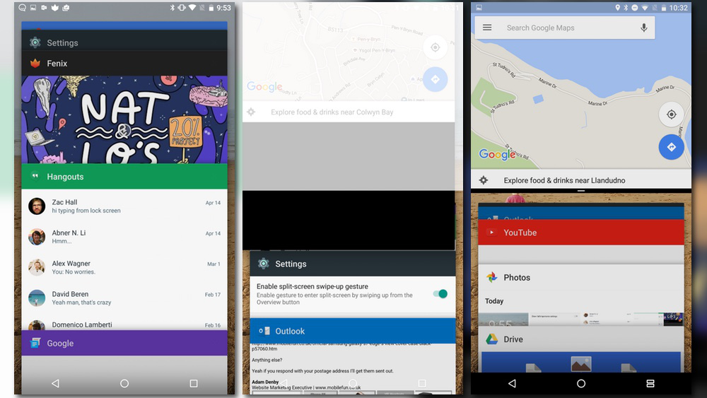
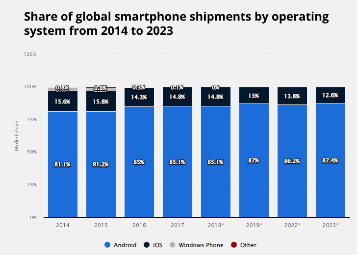
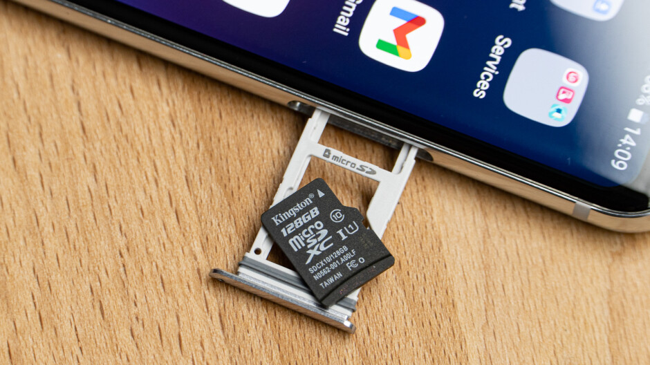

# IOS-vs-ANDROID

This is the comparison between IOS and ANDROID

**Androids are far better than IOS.- Sandip Thapa**

1. Customization: Android allows for a higher level of customization. Users can change home screen layouts, use widgets, and even install alternative launchers to personalize the user experience to a greater extent than IOS. Android, being an open-source platform, offers a high degree of customization, allowing users to tweak various aspects of their devices and applications.Some of them are: Home Screen and Widgets, Wallpaper, Themes and Launchers, Notification Settings, Quick Settings and Status Bar, Fonts and Text Sizes, System Themes, Accessibility etc.

2. Variety of Hardware Options: Android devices come in various shapes, sizes, and price points, giving consumers more choices in terms of hardware.This diversity is one of Android's strengths, as it allows for a broad range of devices with varying capabilities and form factors. This means you can find Android devices that fit your budget and specific requirements.Here are some of the key hardware options you can find in Android devices: Smartphones,Tablets,Wearable Devices,Smart TVs,Gaming Consoles, Smart Home Devices,Drones and Robots,Foldable and Dual-Screen Devices etc. 

3. Open Ecosystem: Android has a more open ecosystem, which can be an advantage for developers and power users who want more control over their devices. You can sideload apps from outside the official app stores and access the file system more freely.

4. Google Services Integration: Android is tightly integrated with Google services, which can be a significant advantage if you're heavily invested in the Google ecosystem (Gmail, Google Photos, Google Drive, etc.).

   

5. Multitasking: Android traditionally offers more robust multitasking capabilities, making it easier to switch between apps and perform various tasks simultaneously. Here are some key aspects of multitasking are :App Switching ,Background Processes,Split-Screen and Picture-in-Picture,Notifications,Task Lifecycle, Task Manager,Background Services,Background Restrictions etc.

 

6. Affordability: Android devices come in a wide range of price points, including budget-friendly options, which can be appealing for cost-conscious consumers. So, people can buy Androids in cheap price.

 

7. Expandable Storage: Many Android devices offer the option to expand storage via microSD cards, which can be essential for users who require a lot of storage space. This feature allows users to store more apps, photos, videos, and other data on their devices without having to rely solely on the internal storage.

 

**Thus Android is far better than IOS due to these varieties of features.**

